# House Price Data Exploration in R

The main purpose of creating this project was to gain an overall understanding of the data. 
Hope this will help you understand the basics. There's more that can be done with this dataset when it comes to visualization and I'll be adding more stuff in near future. 

##### Why this dataset?
Well it's where I think most of the aspiring data scientist would start. This data set is a good starting place to heat up your engines to start thinking like a data scientist at the same time being a novice friendly helps you breeze through the exercise. 

# How do we approach this data????
  - Will this variable help use predict house prices?
  - Is there a correlation between these variables?
  - Univariate Analysis
  - Multivariate Analysis
  - A bit of Data Cleaning
  - Conclude with proving relevance of our selected variables.

###### Best of luck on your journey to master Data Science !  
# 
Now, we start with importing packages, I'll explain why these packages are present along the way...
```
easypackages::libraries("dplyr", "ggplot2", "tidyr", "corrplot", "corrr", "magrittr",   "e1071","ggplot2","RColorBrewer", "viridis")
options(scipen = 5)      #To force R to not use scientfic notation

dataset <- read.csv("train.csv")
str(dataset)    
```
Here, in the above snippet, we use scipen to avoid scientific notation. We import our data and use the str() function to get the gist of the selection of variables which the dataset offers and it's respective data type.

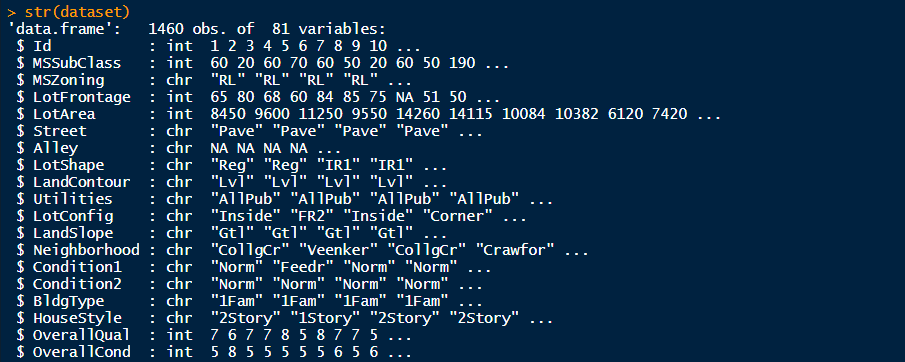

The variable **SalePrice**  is the dependent variable which we are going to base all our assumptions and hypothesis around. So it's good to first understand more about this variable. For this, we'll use a Histogram and fetch a frequency distribution to get a visual understanding about the variable.
You'd notice there's another function  i.e. summary() which is essentially used to for the same purpose but without any form of visualization. With experience you'll be able to understand and interpret this form of information better. 
```
ggplot(dataset, aes(x=SalePrice)) + 
  theme_bw()+
  geom_histogram(aes(y=..density..),color = 'black', fill = 'white', binwidth = 50000)+
  geom_density(alpha=.2, fill='blue') +
  labs(title = "Sales Price Density", x="Price", y="Density")

summary(dataset$SalePrice)
```

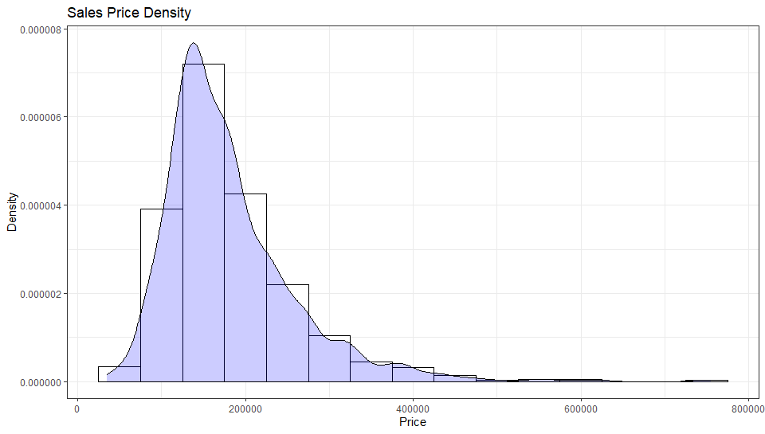
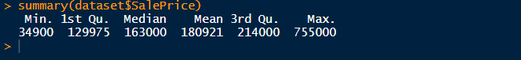

So it is pretty evident that you'll find many properties in the sub $200,000 USD range. There are properties over $600,000 and we can try to understand why is it so and what makes these homes so ridiculously expensive. That can be another fun exercise...

### Which variables do you think are most influential when deciding a price for a house you are looking to buy ? 

Now that we have a basic idea about  **SalePrice** we will try to visualize this variable in terms of some other variable. Please note that it is very important to understand what *type* of variable you are working with. I would like you to refer to this amazing article which covers this topic in more detail [here](https://towardsdatascience.com/data-types-in-statistics-347e152e8bee).

Moving on, We will be dealing with two kinds of variables.
 - **Categorical Variable**
 - **Numeric Variable**

Looking back at our dataset we can discern between these variables. For starters we run a coarse comb across the dataset and guess pick some variables which have the highest chance of being relevant. Note that these are just assumptions and we are exploring this dataset to understand this. The variables I selected are:
 - GrLivArea
 - TotalBsmtSF
 - YearBuilt
 - OverallQual

So which ones are Quantitive and which ones are Qualitative out of the lot ? If you look closely the *OveralQual* and *YearBuilt* variable then you will notice that these variables can never be Quantitative. Year and Quality both are categorical by nature of this data however, **R** doesn't know that. For that we use *factor()* function to convert numerical variable to categorical so **R** can interpret the data better.

```
dataset$YearBuilt <- factor(dataset$YearBuilt)
dataset$OverallQual <- factor(dataset$OverallQual)
```
Now when we run *str()* on our dataset we will see both **YearBuilt** and **OverallQual** as factor variables.

We can now start plotting our variables. 

## Relationships are (NOT) so complicated
Taking *YearBuilt* as our first candidate we start plotting. 
```
ggplot(dataset, aes(y=SalePrice, x=YearBuilt, group=YearBuilt, fill=YearBuilt)) +
  theme_bw()+
  geom_boxplot(outlier.colour="red", outlier.shape=8, outlier.size=1)+
  theme(legend.position="none")+
  scale_fill_viridis(discrete = TRUE) +
  theme(axis.text.x = element_text(angle = 90))+
  labs(title = "Year Built vs. Sale Price", x="Year", y="Price")
```
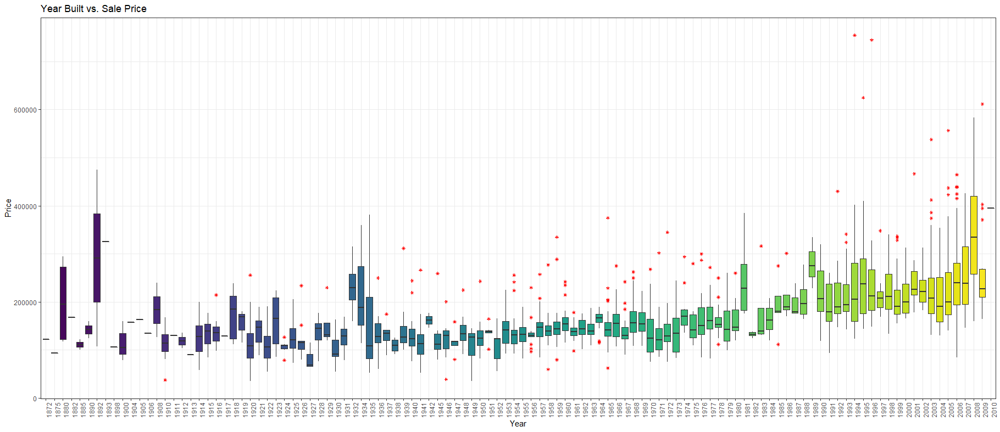

It is pretty evident that old houses sell for less as compared to a recently built house. And as for *OverallQual*,

```
ggplot(dataset, aes(y=SalePrice, x=OverallQual, group=OverallQual,fill=OverallQual)) +
  geom_boxplot(alpha=0.3)+
  theme(legend.position="none")+
  scale_fill_viridis(discrete = TRUE, option="B") +
  labs(title = "Overall Quality vs. Sale Price", x="Quality", y="Price")
```
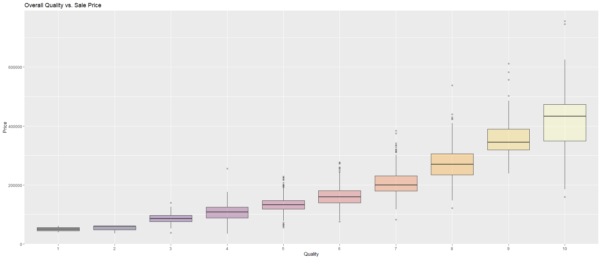
This was expected since you'd naturally pay more for house which is of better quality. You won't want your foot to break through the floor board, will you? Now that the qualitative variables are out of the way we can focus on the numeric variables. The very first candidate we have here is *GrLivArea*.
```
ggplot(dataset, aes(x=SalePrice, y=GrLivArea)) +
  theme_bw()+
  geom_point(colour="Blue", alpha=0.3)+
  theme(legend.position='none')+
  labs(title = "General Living Area vs. Sale Price", x="Price", y="Area")
```
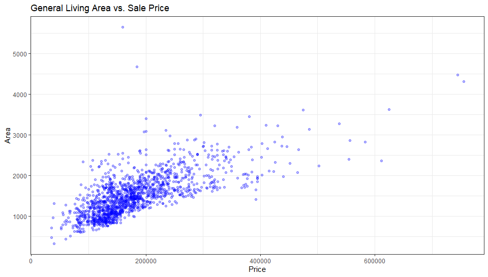

I would be lying if I said I didn't expect this. The very first instinct of a customer is to check the area of rooms. And I think the result will be same for *TotalBsmtASF*. Let's see..
```
ggplot(dataset, aes(x=SalePrice, y=TotalBsmtSF)) +
  theme_bw()+
  geom_point(colour="Blue", alpha=0.3)+
  theme(legend.position='none')+
  labs(title = "Total Basement Area vs. Sale Price", x="Price", y="Area")
```
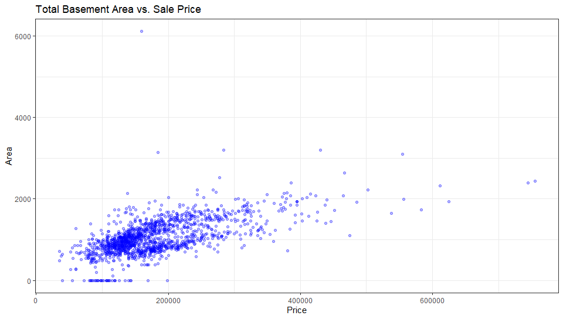

### So what can we say about our cherry picked variables?
*GrLivArea* and *TotalBsmtSF* both were found to be in a linear relation with *SalePrice*.
As for the categorical variables, we can say with confidence that the two variable which we picked were related to *SalePrice* with confidence. 

But these are not the only variables and there's more to than what meets the eye. So to tread over these many variables we'll take help from a correlation matrix to see how each variable correlate to get a better insight.

# Time for Correlation Plots
**So what is Correlation?**
>Correlation is a measure of how well two variables are related to each other. There are positive as well as negative correlation.


If you want to read more on Correlation then take a look at this [article](https://medium.com/@SilentFlame/pearson-correlation-a-mathematical-understanding-c9aa686113cb).
So let's create a basic Correlation Matrix.
```
M <- cor(dataset)
M <- dataset %>% mutate_if(is.character, as.factor)
M <- M %>% mutate_if(is.factor, as.numeric)
M <- cor(M)

mat1 <- data.matrix(M)
print(M)

#plotting the correlation matrix
corrplot(M, method = "color", tl.col = 'black', is.corr=FALSE)       
```
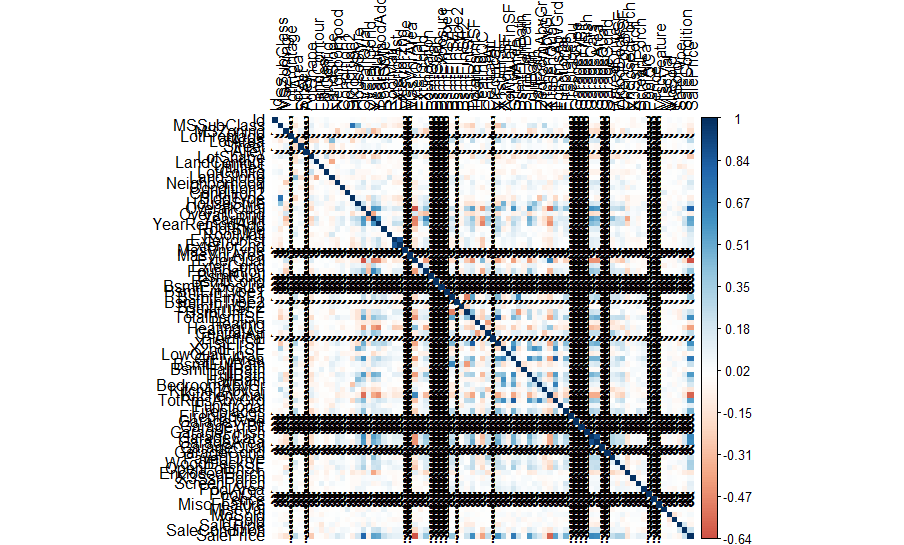

#### This looks like a mess
But worry not because now we're going to get our hands dirty and make this plot interpretable and tidy.

```
M[lower.tri(M,diag=TRUE)] <- NA                   #remove coeff - 1 and duplicates
M[M == 1] <- NA

M <- as.data.frame(as.table(M))                   #turn into a 3-column table
M <- na.omit(M)                                   #remove the NA values from above 

M <- subset(M, abs(Freq) > 0.5)              #select significant values, in this case, 0.5
M <- M[order(-abs(M$Freq)),]                                  #sort by highest correlation


mtx_corr <- reshape2::acast(M, Var1~Var2, value.var="Freq")    #turn M back into matrix 
corrplot(mtx_corr, is.corr=TRUE, tl.col="black", na.label=" ") #plot correlations visually
```
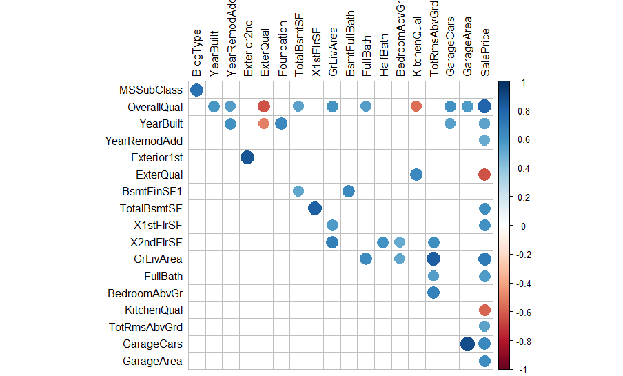
#### Now this looks much better and readable.
Looking at our plot we can see numerous other variables which are highly correlated with *SalePrice*. We pick these variables and then create a new dataframe by only including these select variables.

Now that we have our suspect variables we can use a **PairPlot** to visualize all these variables in conjunction of each other.
```
newData <- data.frame(dataset$SalePrice, dataset$TotalBsmtSF, 
                      dataset$GrLivArea, dataset$OverallQual, 
                      dataset$YearBuilt, dataset$FullBath, 
                      dataset$GarageCars )

pairs(newData[1:7], 
      col="blue",
      main = "Pairplot of our new set of variables"         
)
```
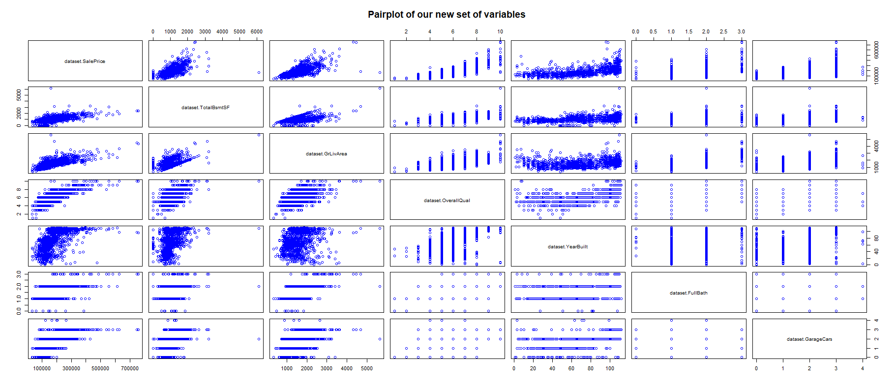

#### While you're at it, clean your data
We should remove some useless variables which we are sure of not being of any use. Don't apply changes to the original dataset though. Always create a new copy in case you remove something you shouldn't have.
```
clean_data <- dataset[,!grepl("^Bsmt",names(dataset))]      #remove BSMTx variables

drops <- c("clean_data$PoolQC", "clean_data$PoolArea", 
               "clean_data$FullBath", "clean_data$HalfBath")
               
clean_data <- clean_data[ , !(names(clean_data) %in% drops)]

#The variables in 'drops'are removed.
```
# Univariate Analysis
Taking a look back at our old friend, *SalePrice*, we see some houses which are extremely expensive. We haven't dwelved into why is that so. Although we do know that these extremely pricey houses don't follow the pattern which other house prices are following. 
The reason for such high prices could be justified but for the sake of our analysis, we have to drop them. Such records are called **Outliers**. 
>Simple way to understand Outliers is to think of them as that one guy (or more) in your group who likes to eat noodles with a spoon instead of a fork. 

So first, we catch these outliers and then remove them from our dataset if need be. Let's start with the *catching* part.
```
#Univariate Analysis

clean_data$price_norm <- scale(clean_data$SalePrice)    #normalizing the price variable

summary(clean_data$price_norm)

plot1 <- ggplot(clean_data, aes(x=factor(1), y=price_norm)) +
  theme_bw()+
  geom_boxplot(width = 0.4, fill = "blue", alpha = 0.2)+
  geom_jitter( 
              width = 0.1, size = 1, aes(colour ="red"))+
  geom_hline(yintercept=6.5, linetype="dashed", color = "red")+
  theme(legend.position='none')+
  labs(title = "Hunt for Outliers", x=NULL, y="Normalized Price")

plot2 <- ggplot(clean_data, aes(x=price_norm)) + 
  theme_bw()+
  geom_histogram(color = 'black', fill = 'blue', alpha = 0.2)+
  geom_vline(xintercept=6.5, linetype="dashed", color = "red")+
  geom_density(aes(y=0.4*..count..), colour="red", adjust=4) +
  labs(title = "", x="Price", y="Count")

grid.arrange(plot1, plot2, ncol=2)

```
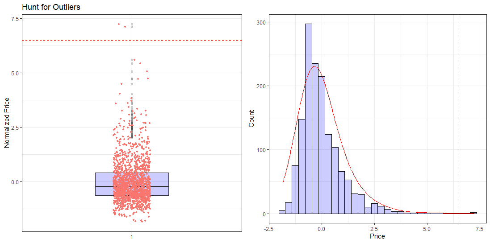
The very first thing I did here was normalize **SalePrice** so that it's more interpretable and it's easier to bottom down on these outliers. The normalized SalePrice has *Mean= 0* and *SD= 1*. Running a quick *'summary()'* on this new variable **price_norm** give us this...

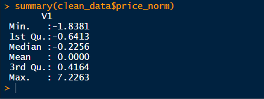

So now we know for sure that there **ARE** outliers present here. But do we really need to get rid of them? From the previous scatterplots we can say that these outliers are still following along with the trend and don't need purging yet. Deciding what to do with outliers can be quite complex at times.
You can read more on outliers [here](https://www.theanalysisfactor.com/outliers-to-drop-or-not-to-drop/).

# Bi-Variate Analysis
Bivariate analysis is the simultaneous analysis of two variables (attributes). It explores the concept of relationship between two variables, whether there exists an association and the strength of this association, or whether there are differences between two variables and the significance of these differences. There are three types of bivariate analysis.		
- Numerical & Numerical
- Categorical & Categorical
- Numerical & Categorical

The very first set of variables we will analyze here are *SalePrice* and *GrLivArea*. Both variables are Numerical so using a Scatter Plot is a good idea !
```
ggplot(clean_data, aes(y=SalePrice, x=GrLivArea)) +
  theme_bw()+
  geom_point(aes(color = SalePrice), alpha=1)+
  scale_color_gradientn(colors = c("#00AFBB", "#E7B800", "#FC4E07")) +
  labs(title = "General Living Area vs. Sale Price", y="Price", x="Area")
```
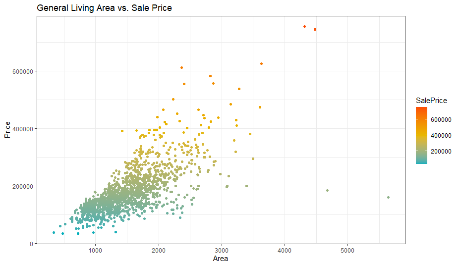

Immediately, we notice that 2 houses don't follow the linear trend and affects both our results and assumptions. These are our outliers. Since our results in future are prone to be affected negatively by these outliers, we will remove them.

```
clean_data <- clean_data[!(clean_data$GrLivArea > 4000),]   #remove outliers

ggplot(clean_data, aes(y=SalePrice, x=GrLivArea)) +
  theme_bw()+
  geom_point(aes(color = SalePrice), alpha=1)+
  scale_color_gradientn(colors = c("#00AFBB", "#E7B800", "#FC4E07")) +
  labs(title = "General Living Area vs. Sale Price [Outlier Removed]", y="Price", x="Area")
```
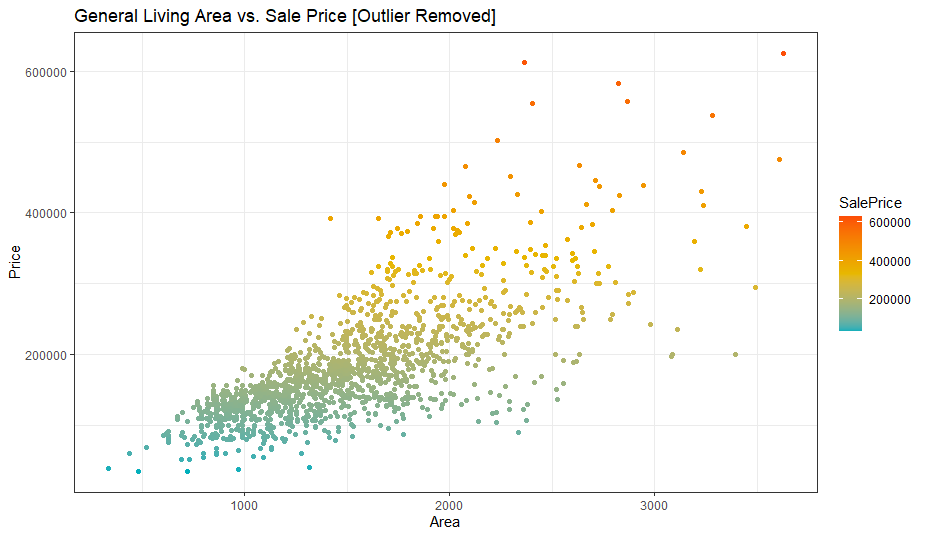

The outlier is removed and the x-scale is adjusted. Next set of variables which we will analyze are *SalePrice* and *TotalBsmtSF*.
```
ggplot(clean_data, aes(y=SalePrice, x=TotalBsmtSF)) +
  theme_bw()+
  geom_point(aes(color = SalePrice), alpha=1)+
  scale_color_gradientn(colors = c("#00AFBB", "#E7B800", "#FC4E07")) +
  labs(title = "Total Basement Area vs. Sale Price", y="Price", x="Basement Area")
```
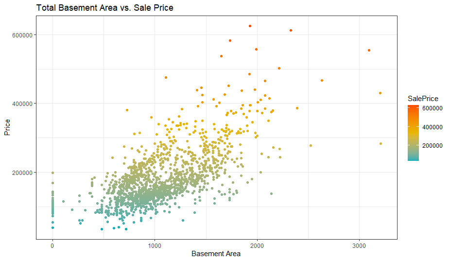

The observations here adhere to our assumptions and don't really need purging. **If it ain't broke, don't fix it.** 
I did mention that it is important to tread very carefully when working with outliers. You don't get to remove them everytime.

---

# Time to dig a bit deeper
We based a ton of visualization around 'SalePrice' and other important variables, but what If I said that's not enough?
**It's not**
Because there's more to dig out of this pit. There are 4 horsemen of Data Analysis which I believe people should remember.
 - Normality : When we talk about normality what we mean is that the data should look like a normal distribution. This is important because several statistic tests rely on this (e.g. t-statistics). In this exercise we'll just check univariate normality for 'SalePrice' (which is a limited approach). Remember that univariate normality doesn't ensure multivariate normality (which is what we would like to have), but it helps. Another detail to take into account is that in big samples (>200 observations) normality is not such an issue. However, if we solve normality, we avoid a lot of other problems (e.g. heteroscedacity) so that's the main reason why we are doing this analysis.
 
 - Homoscedasticity : Homoscedasticity refers to the 'assumption that dependent variable(s) exhibit equal levels of variance across the range of predictor variable(s)'. Homoscedasticity is desirable because we want the error term to be the same across all values of the independent variables.
 
 - Linearity : The most common way to assess linearity is to examine scatter plots and search for linear patterns. If patterns are not linear, it would be worthwhile to explore data transformations. However, we'll not get into this because most of the scatter plots we've seen appear to have linear relationships. 
 
 - Absence of correlated errors : Correlated errors, like the definition suggests, happen when one error is correlated to another. For instance, if one positive error makes a negative error systematically, it means that there's a relationship between these variables. This occurs often in time series, where some patterns are time related. We'll also not get into this. However, if you detect something, try to add a variable that can explain the effect you're getting. That's the most common solution for correlated errors.
 
### I think we should start doing rather than saying
Starting with *SalePrice*. Do keep an eye on the overall distribution of our variable. 
```
plot3 <- ggplot(clean_data, aes(x=SalePrice)) + 
  theme_bw()+
  geom_density(fill="#69b3a2", color="#e9ecef", alpha=0.8)+
  geom_density(color="black", alpha=1, adjust = 5, lwd=1.2)+
  labs(title = "Sale Price Density", x="Price", y="Density")


plot4 <- ggplot(clean_data, aes(sample=SalePrice))+
  theme_bw()+
  stat_qq(color="#69b3a2")+
  stat_qq_line(color="black",lwd=1, lty=2)+
  labs(title = "Probability Plot for SalePrice")

grid.arrange(plot3, plot4, ncol=2)
```
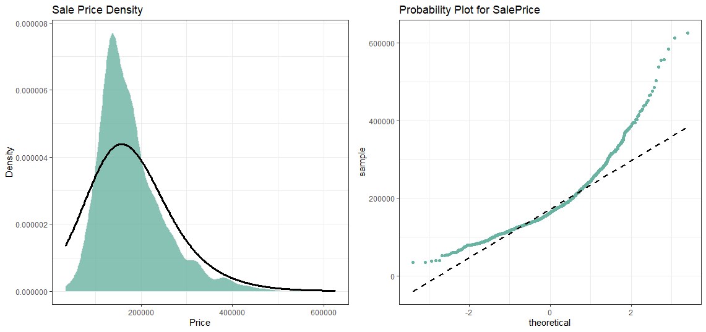

*SalePrice* is definitely not normal! But we have another trick up our sleeves viz. **log transformation**. Now, one great thing about log transformation is that it can deal with skewed data and make it normal. So now it's time to apply the log transformation over our variable.

```
clean_data$log_price <- log(clean_data$SalePrice)         


plot5 <- ggplot(clean_data, aes(x=log_price)) + 
  theme_bw()+
  geom_density(fill="#69b3a2", color="#e9ecef", alpha=0.8)+
  geom_density(color="black", alpha=1, adjust = 5, lwd=1)+
  labs(title = "Sale Price Density [Log]", x="Price", y="Density")

plot6 <- ggplot(clean_data, aes(sample=log_price))+
  theme_bw()+
  stat_qq(color="#69b3a2")+
  stat_qq_line(color="black",lwd=1, lty=2)+
  labs(title = "Probability Plot for SalePrice [Log]")

grid.arrange(plot5, plot6, ncol=2)
```
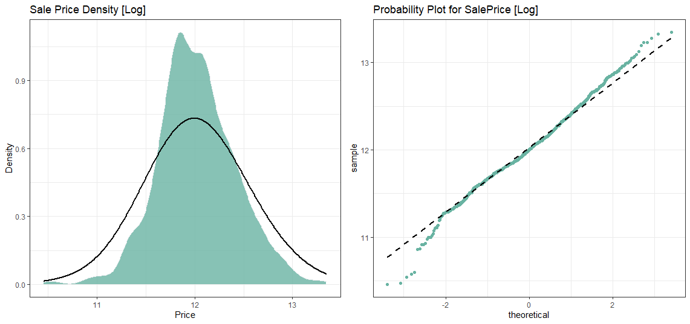
---
## Now repeat the process with rest of our variables.
#### We go with *GrLivArea* first..


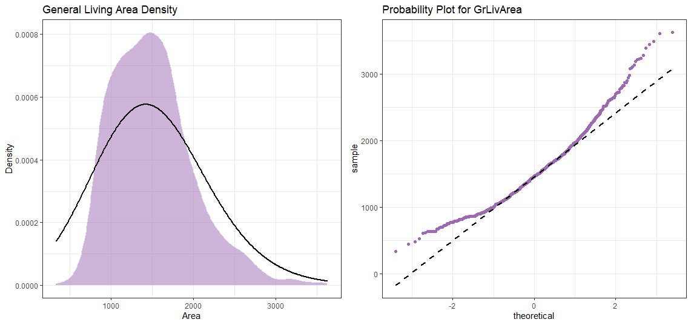

#### After Log Transformation..

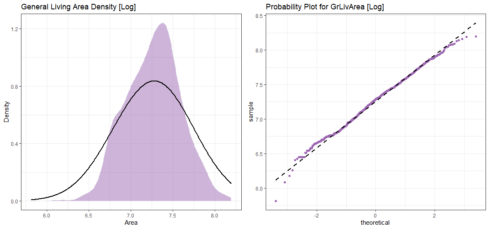
---
### Now for *TotalBsmtSF*
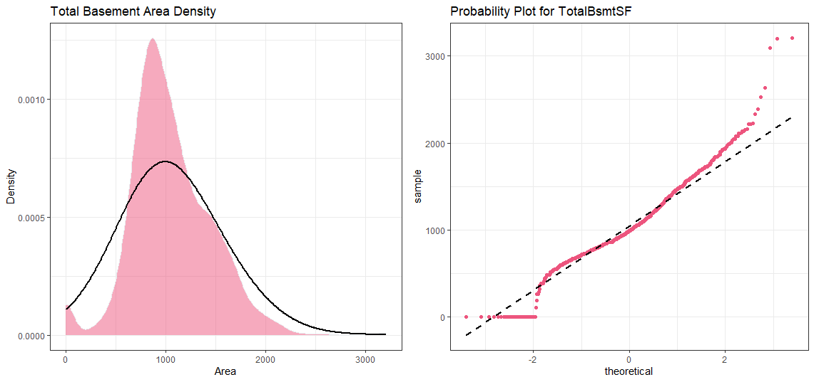

## Hold On! We've got something interesting here.

Looks like *TotalBsmtSF* has some zeroes. This doesn't bode well with log transformation. We'll have to do something about it. To apply a log transformation here, we'll create a variable that can get the effect of having or not having basement (binary variable). Then, we'll do a log transformation to all the non-zero observations, ignoring those with value zero. This way we can transform data, without losing the effect of having or not basement.

```
#The step where I create a new variable to dictate which row to transform and which to ignore
clean_data <- transform(clean_data, cat_bsmt = ifelse(TotalBsmtSF>0, 1, 0))

#Now we can do log transformation
clean_data$totalbsmt_log <- log(clean_data$TotalBsmtSF)

clean_data<-transform(clean_data,totalbsmt_log = ifelse(cat_bsmt == 1, log(TotalBsmtSF), 0 ))

plot13 <- ggplot(clean_data, aes(x=totalbsmt_log)) + 
  theme_bw()+
  geom_density(fill="#ed557e", color="#e9ecef", alpha=0.5)+
  geom_density(color="black", alpha=1, adjust = 5, lwd=1)+
  labs(title = "Total Basement Area Density [transformed]", x="Area", y="Density")

plot14 <- ggplot(clean_data, aes(sample=totalbsmt_log))+
  theme_bw()+
  stat_qq(color="#ed557e")+
  stat_qq_line(color="black",lwd=1, lty=2)+
  labs(title = "Probability Plot for TotalBsmtSF [transformed]")

grid.arrange(plot13, plot14, ncol=2)
```
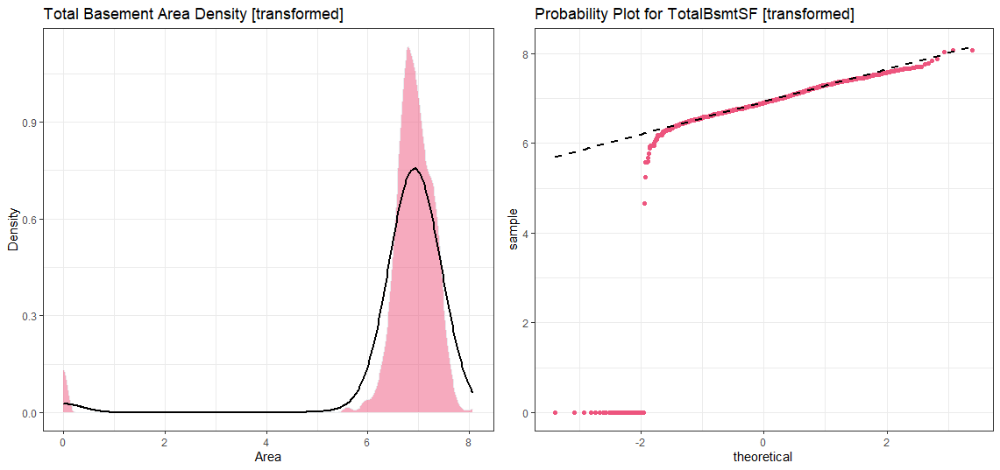

We can still see the ignored datapoints on the chart but hey, I can trust you with this, right? 
---
## Homoscedasticity -- *wait is my spelling correct?*
The best way to look for homoscedasticity is to work try and visualize the variables using charts. A scatter plot should do the job. Notice the shape which the data forms when plotted. It could look like an equal dispersion which looks like a cone or it could very well look like a diamond where a large number of data points are spread around the centre.

Starting with ‘SalePrice’ and ‘GrLivArea’…
```
ggplot(clean_data, aes(x=grlive_log, y=log_price)) +
  theme_bw()+
  geom_point(colour="#e34262", alpha=0.3)+
  theme(legend.position='none')+
  labs(title = "Homoscedasticity : Living Area vs. Sale Price ", x="Area [Log]", y="Price [Log]")
```
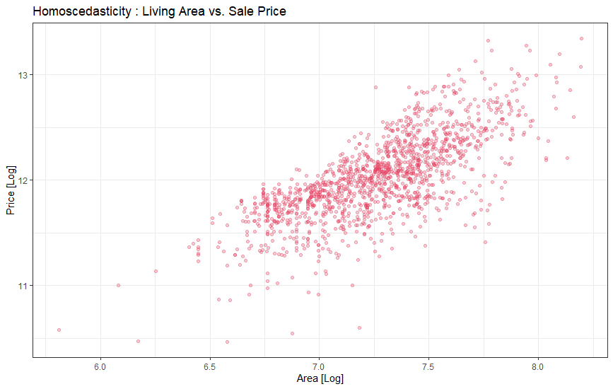

We plotted ‘SalePrice’ and ‘GrLivArea’ before but then why is the plot different? That’s right, because of the log transformation.
If we go back to the previously plotted graphs showing the same variable, it is evident that the data has a conical shape when plotted. But after log transformation, the conic shape is no more. Here we solved the homoscedasticity problem with just one transformation. Pretty powerful eh?

Now let’s check ‘SalePrice’ with ‘TotalBsmtSF’.
```
ggplot(clean_data, aes(x=totalbsmt_log, y=log_price)) +
  theme_bw()+
  geom_point(colour="#e34262", alpha=0.3)+
  theme(legend.position='none')+
  labs(title = " Homoscedasticity : Total Basement Area vs. Sale Price", x="Area [Log]", y="Price [Log]")
```
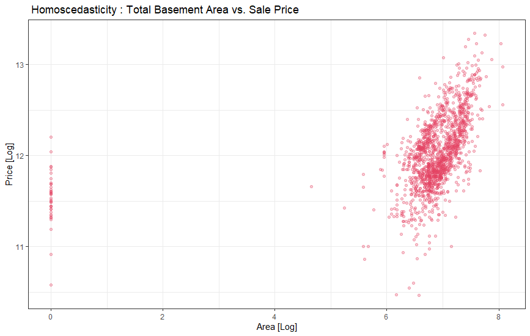
## That's it, we've reached the end of our Analysis. Now all that's left is to get the dummy variables and... you know the rest. :) 
This work was possible thanks to [Pedro Marcelino](https://www.kaggle.com/pmarcelino). I found his Analysis on this dataset in Python and wanted to re-write it in R. Give him some love!
